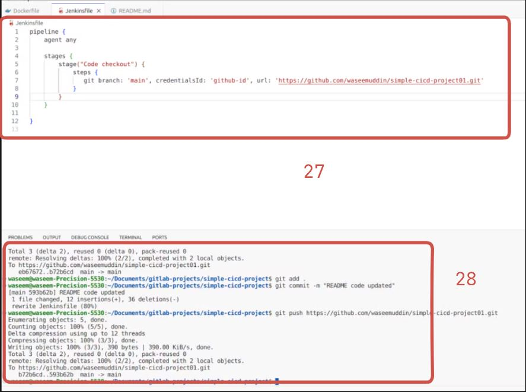
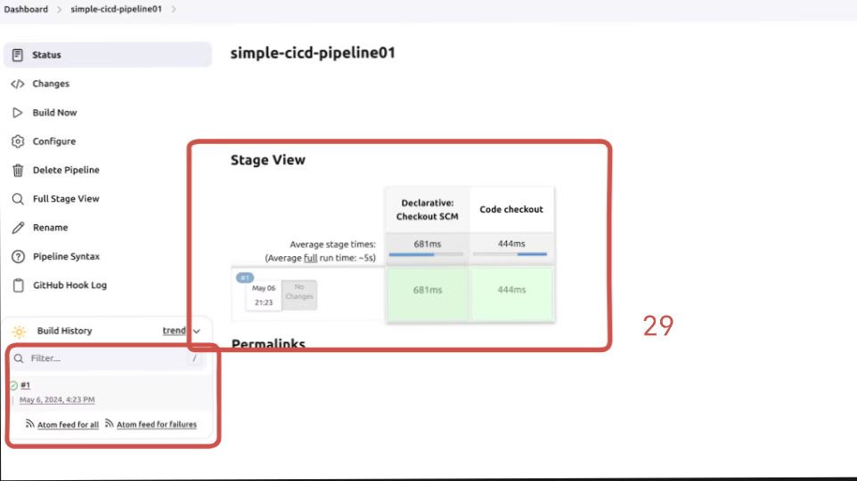
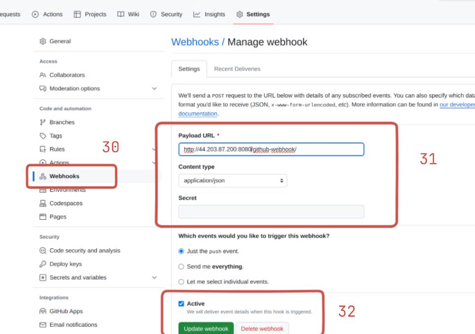
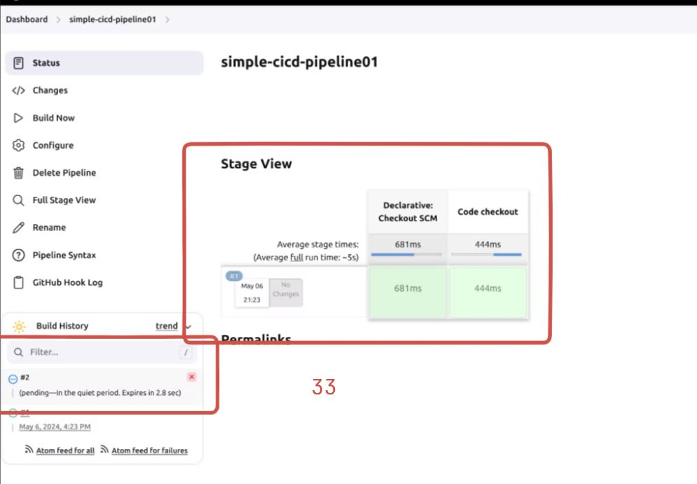

# Simple CICD Pipeline Project - Todo Application 

Please follow the below links for more updates and Projects.

💾 <a href="https://shaikhwaseem.com" target="_blank">shahikhwaseem.com</a> <br>

💾 <a href="https://www.youtube.com/@waseeemuddin" target="_blank">Youtube Link</a>

## Prerequisites

1. EC2 Machine - Medium Size will be prefreable 
2. Docker Setup on EC2 Machine.
3. Jenkins Setup - either you use manuall installation or you can use jenkins image.
4. Github Account - you need a github account to automate the pipleline 

Here is Archietchure Diagram 

# 


### Step 01 - Create EC2 Machine 

# 
# 
# 
# 

### Step 02 - Connect EC2 Machine  

Now next step is to connect your EC2 Ubuntu Machine using SSH and make sure you're in root user or use 'sudo'

``` shell
$ sudo ssh -i "key.pem" ubuntu@<ip-addressmkdir> 
```
# 

### Step 03 - Install docker on Ec2 machine

In step 3 you need to install the docker on your ec2 machine.
docker installation commands are simple and easily docker setup.
You can find installation steups from as below address : https://docs.docker.com/engine/install/ubuntu/
Here is the docker script to be execute on Ubuntu 22.04

1.Set up Docker's apt repository.

``` shell
$ # Add Docker's official GPG key:
sudo apt-get update
sudo apt-get install ca-certificates curl
sudo install -m 0755 -d /etc/apt/keyrings
sudo curl -fsSL https://download.docker.com/linux/ubuntu/gpg -o /etc/apt/keyrings/docker.asc
sudo chmod a+r /etc/apt/keyrings/docker.asc

# Add the repository to Apt sources:
echo \
  "deb [arch=$(dpkg --print-architecture) signed-by=/etc/apt/keyrings/docker.asc] https://download.docker.com/linux/ubuntu \
  $(. /etc/os-release && echo "$VERSION_CODENAME") stable" | \
  sudo tee /etc/apt/sources.list.d/docker.list > /dev/null
sudo apt-get update

```
2. Install the Docker packages.
``` shell
$ sudo apt-get install docker-ce docker-ce-cli containerd.io docker-buildx-plugin docker-compose-plugin
```
# 


### Step 03 - Installation of Jenkins 

Next step is to installation of Jenkins. There are two ways to install/setup jenkins
1. Manuall installation or stand-alone installation
2. container based installation which is flexiable and easy to handle and light weight
Here we setup the jenkins via container based installation.

``` shell
$ docker run -p 8080:8080 -p 50000:50000 -d \
-v jenkins_home:/var/jenkins_home \
-v /var/run/docker.sock:/var/run/docker.sock \
-v $(which docker): /usr/bin/docker jenkins/jenkins:lts
```
# 

After running the above command jenkins container has been created and started

# 

Now you can type blow ip addess if your ec2 machine and check weather your jenkins is accessiable or not 
But make sure that the port should be added on your EC2 Security Group

# 
# 

``` shell
$ localhost:8080

$ <ip-address>:porty

```
# 

Now, In order to get the jenkins password. you have to login or access the jenkins container

``` shell
$ docker exec -it <container-id> bash

$ docker exec -it 98760878abree bash

```
# 

### Step 04 - Jenkins Pipleline Setup

Till now, we have setup the EC2 server and configure the docker and our jenkins setup
Now in this step we can see how we can create the jenkins simple pipeline 

Now before create the pipeline and connect your git-repo to jenkins. please make sure you have upto date
Git repository. To download the update git here are below links

``` shell
$ https://github.com/waseemuddin/simple-cicd-project01.git # this is  my link repo where i have update all files and codes

$ https://github.com/docker/getting-started-app.git # and here is the doker official repo

```
Now let get start and create the pipleline

Login jenkins using same password as create above.

# 

# 

There are 2 ways to creating the pipeline code either inline pipleline or pipleline script with SCM means using Jenkinsfile
The latest and best approch is to using Jenkinsfile

# 

# 

After setting up the pipleline and connected to git repo. now lets test the below code and see your our pipeline works or not

First create the Jenkinsfile in your git repo and add the below code in Jenkinsfile

``` shell
pipeline {
    agent any
    stages {
        stage("Code checkout") {
            steps {
               git branch: 'main', credentialsId: 'github-id', url: 'https://github.com/waseemuddin/simple-cicd-project01.git'
            }
        }
    }
}
```

# 

Now Jenkinsfile has been updated. Goto pileline and press the "Build Now" to check the pipeline fetch git repo and shows the stage view. 

# 

### Step 05 - Jenkins Set Webhook - Automate the Pileline Process 

# 

Now in order to autmoate the jenkins pipeline, we need to set the git webhook and connect your jenkins server to git webhook

just to repository then goto setting and click webhooks. Here you have to mention the jenkins server ip and port as per below format

Aftet setting the webhook. lets make some changes in git repo files anything you want like add some comments and push the code.

As soon as push triggerd jenkins server auto fetch and auto build start automatically. As per given video.

# 

### Step 05 - Final Step - Run Complete code

Now in last step we create the complete pipeline steps from Code Checkout to Container Creating steps

Updated code is available in Jenkins-File

``` shell
pipeline {
    agent any

    stages {
        stage("Code checkout") {  # Git Repo Check-out Step
            steps {
               git branch: 'main', credentialsId: 'github-id', url: 'https://github.com/waseemuddin/simple-cicd-project01.git'
            }
        }
        stage("image build") {  # Image Build Step and make sure you have to create the empty repository on your Docker-Hub Account
            steps {
                sh 'docker image build -t waseem63/mydockerapp:v$BUILD_ID .'
                sh 'docker image tag waseem63/mydockerapp:v$BUILD_ID waseem63/mydockerapp:latest'
            }
        }
        stage("Image Push") {  # Image Push Step and connect to your docker-hub account. Also remove the image so the storage can be maintain
            steps { 
                withCredentials([usernamePassword(credentialsId: 'docker-hub-id', passwordVariable: 'PASS', usernameVariable: 'USER')]) {
                    
                    sh "echo $PASS | docker login -u $USER --password-stdin"
                    sh 'docker push waseem63/mydockerapp:v$BUILD_ID'
                    sh 'docker push waseem63/mydockerapp:latest'
                    sh 'docker rmi waseem63/mydockerapp:v$BUILD_ID  waseem63/mydockerapp:latest'
                }
            }
            
        }
        stage("Container Creating") { # last step is to fetch the lastet or recent image and create docker container automatically.
            steps {
                sh 'docker run -itd --name todoapp -p 3000:3000 waseem63/mydockerapp:latest'
            
            }
        }
        
    }
}

```
