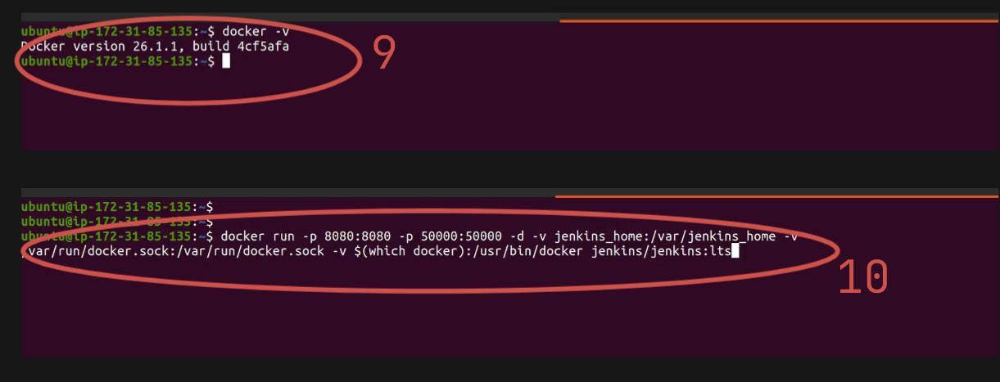

# Simple CICD Pipeline Project - Todo Application 

Please follow the below links for more updates and Projects.

💾 <a href="https://shaikhwaseem.com" target="_blank">shahikhwaseem.com</a> <br>

💾 <a href="https://www.youtube.com/@waseeemuddin" target="_blank">Youtube Link</a>

## Prerequisites
1. EC2 Machine - Medium Size will be prefreable 
2. Docker Setup on EC2 Machine.
3. Jenkins Setup - either you use manuall installation or you can use jenkins image.
4. Github Account - you need a github account to automate the pipleline 

Here is Archietchure Diagram 

# 


### Step 01 - Create EC2 Machine 

# 
# 
# 
# 

### Step 02 - Connect EC2 Machine  

Now next step is to connect your EC2 Ubuntu Machine using SSH and make sure you're in root user or use 'sudo'

``` shell
$ sudo ssh -i "key.pem" ubuntu@<ip-addressmkdir> 
```
# 

### Step 03 - Install docker on Ec2 machine

In step 3 you need to install the docker on your ec2 machine.
docker installation commands are simple and easily docker setup.
You can find installation steups from as below address : https://docs.docker.com/engine/install/ubuntu/
Here is the docker script to be execute on Ubuntu 22.04

1.Set up Docker's apt repository.

``` shell
$ # Add Docker's official GPG key:
sudo apt-get update
sudo apt-get install ca-certificates curl
sudo install -m 0755 -d /etc/apt/keyrings
sudo curl -fsSL https://download.docker.com/linux/ubuntu/gpg -o /etc/apt/keyrings/docker.asc
sudo chmod a+r /etc/apt/keyrings/docker.asc

# Add the repository to Apt sources:
echo \
  "deb [arch=$(dpkg --print-architecture) signed-by=/etc/apt/keyrings/docker.asc] https://download.docker.com/linux/ubuntu \
  $(. /etc/os-release && echo "$VERSION_CODENAME") stable" | \
  sudo tee /etc/apt/sources.list.d/docker.list > /dev/null
sudo apt-get update

```
2. Install the Docker packages.
``` shell
$ sudo apt-get install docker-ce docker-ce-cli containerd.io docker-buildx-plugin docker-compose-plugin
```
# 


### Step 02 - create some files in the git local directory/folder

``` shell
$ mkdir imges 
$ mkdir js
$ mkdir css
$ mkdir project 
$ touch css/front.css
$ touch js/mysim.js
$ touch index.php
```


### Step 03 - After editing and adding completed, run the below commands

``` shell
$ git init
$ git status
$ git add .
$ git commit
```
# 

# 

# 

# 

Our local repository files are commited and now its time to push into remote repository

# 

To push your code to remote repository, first you have to create the empty reposity on your github account

### Step 04 - Create Empty Repo on your Github Account
 
Got your GitHub accunt profile and create a new repository

 # 

 # 


### Step 05 - Push Local Repo to Remote Repo

Now its time to push your local repository to your remote repository means your Github account

 # 

 # 

 # 

 # 


As you see all local repository files/folders are now push to remote repository


 # 

