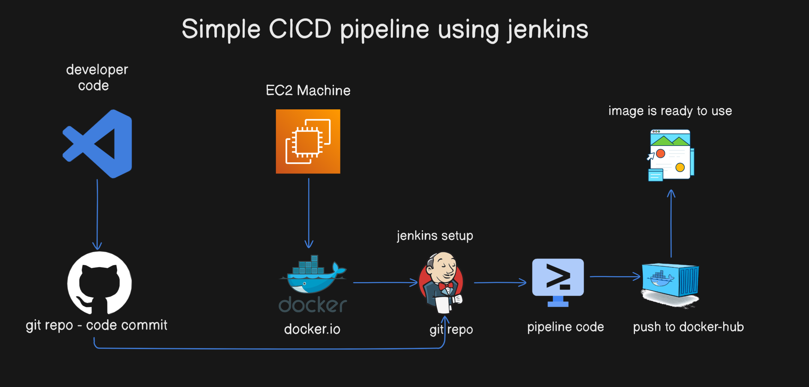
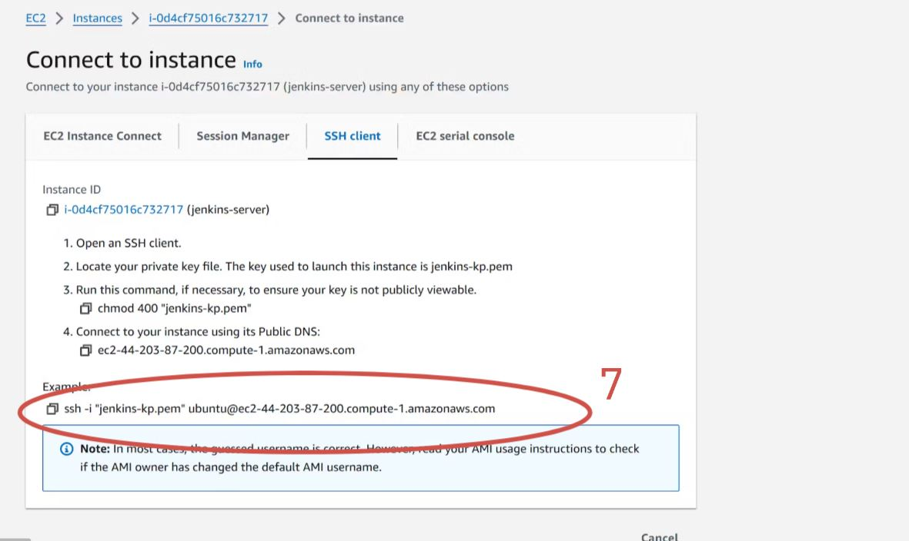
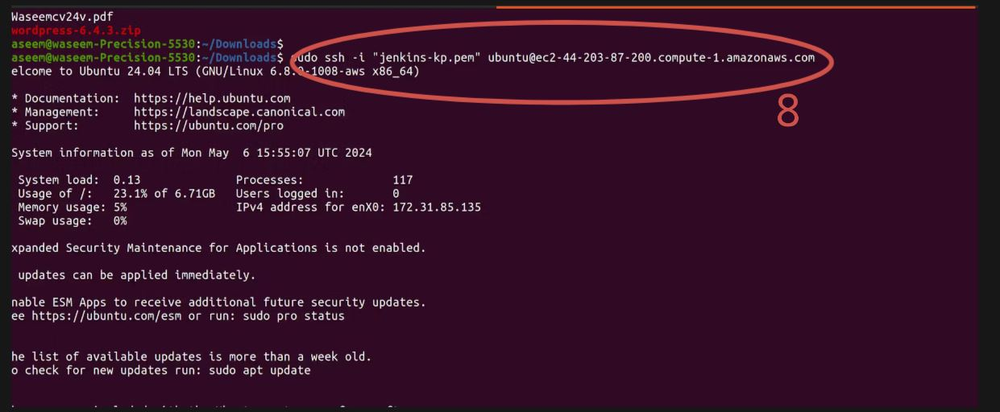

# Simple CICD Pipeline Project - Todo Application 

Welcome to the Simple CICD Pipeline Project for a Todo Application. Follow the steps below to set up your Continuous Integration and Continuous Deployment pipeline.

## Prerequisites
Ensure you have the following prerequisites before proceeding:
1. **EC2 Machine**: Medium Size preferred.
2. **Docker Setup** on EC2 Machine.
3. **Jenkins Setup**: You can either manually install Jenkins or use a Jenkins image.
4. **GitHub Account**: You need a GitHub account to automate the pipeline.

For more updates and projects, visit:
- 💾 [shaikhwaseem.com](https://shaikhwaseem.com)
- 💾 [YouTube Channel](https://www.youtube.com/@waseeemuddin)

## Architecture Diagram


### Step 01 - Create EC2 Machine 




### Step 02 - Connect EC2 Machine  
Connect to your EC2 Ubuntu Machine using SSH. Make sure you're in the root user or use 'sudo'.
```shell
$ sudo ssh -i "key.pem" ubuntu@<ip-address>
```



### Step 03 - Install Docker on EC2 Machine
Install Docker on your EC2 machine. Use the following commands:

# Set up Docker's apt repository.

```shell
$ sudo apt-get update
$ sudo apt-get install ca-certificates curl
$ sudo install -m 0755 -d /etc/apt/keyrings
$ sudo curl -fsSL https://download.docker.com/linux/ubuntu/gpg -o /etc/apt/keyrings/docker.asc
$ sudo chmod a+r /etc/apt/keyrings/docker.asc
$ echo \
  "deb [arch=$(dpkg --print-architecture) signed-by=/etc/apt/keyrings/docker.asc] https://download.docker.com/linux/ubuntu \
  $(. /etc/os-release && echo "$VERSION_CODENAME") stable" | \
  sudo tee /etc/apt/sources.list.d/docker.list > /dev/null
$ sudo apt-get update

# Install Docker packages.
$ sudo apt-get install docker-ce docker-ce-cli containerd.io docker-buildx-plugin docker-compose-plugin
```
